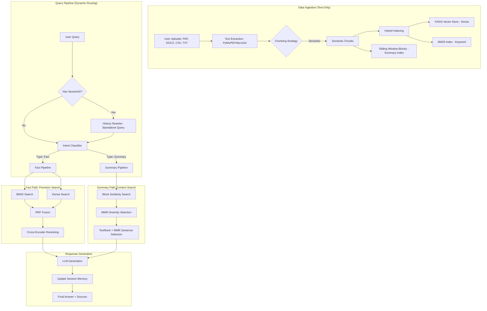

# InsightAI 🤖 — Advanced RAG Chatbot

InsightAI is a professional-grade full-stack chatbot that enables deep document analysis. It combines a high-performance **FastAPI** backend with a modern **React/TypeScript** frontend, featuring a hybrid RAG pipeline designed for both factual retrieval and multi-document summarization.

---

## 🛠 Tech Stack

### **Frontend**
- **React 18 & TypeScript**: For a type-safe, component-based UI.
- **Vite**: Ultra-fast build tool and dev server.
- **Tailwind CSS**: For a sleek, responsive dark-mode interface.
- **Markdown & KaTeX**: Properly renders AI responses with lists, code blocks, and math.

### **Backend**
- **Python 3.9+ & FastAPI**: Asynchronous REST API for high performance.
- **PyMuPDF (fitz)**: High-speed PDF text and structure extraction.
- **docx2txt & CSV**: Support for Office and data documents.
- **Docker & Docker Compose**: For seamless, containerized deployment.

### **AI & RAG Engine**
- **Embeddings**: `BAAI/bge-small-en-v1.5` (via HuggingFace) for high-quality semantic vectors.
- **Vector Store**: **FAISS** (Facebook AI Similarity Search) for dense retrieval.
- **Keyword Search**: **BM25 (Rank-BM25)** for precise term matching.
- **Reranker**: **Cross-Encoder** (`ms-marco-MiniLM`) for scoring candidates after retrieval.
- **LLM Support**: 
  - **Local-first**: Integration with **LM Studio** (OpenAI-compatible endpoint).
  - **Fallback**: **Google Gemini API** support.

### **Evaluation & Metrics** (`backend/rag/metrics.py`)
- **Retrieval quality**: Precision@5, Recall@5, MRR, NDCG@5 (binary relevance, ground truth resolved from `chunk_id` or `expected_keywords`).
- **Baselines compared side-by-side**: BM25 only, Dense only, Hybrid (BM25 + dense + RRF + cross-encoder rerank).
- **Answer quality**: LLM-as-judge faithfulness in [1, 5] (uses the same OpenRouter model that generates answers, so judge and judged model are the same family).
- **Latency**: per-stage stopwatch for `retrieve_ms`, `rerank_ms`, `generate_ms`, `total_ms`, plus the LLM provider that actually answered (OpenRouter / LMStudio / Google).

---

## 🏗 Architecture & Workflow

InsightAI follows a sophisticated retrieval-augmented generation (RAG) pattern, optimized for both precision and broad context understanding.



---

## 🧠 Architecture Decisions & Trade-offs

This project is built with a focus on **privacy, performance, and transparency**. Every technical choice was made by weighing the pros and cons of modern AI engineering patterns.

### 1. **Backend Service: Why FastAPI?**
*   **Decision**: Use **FastAPI** over Flask or Django.
*   **Rational**: RAG applications are I/O bound (waiting for embeddings, vector search, and LLM responses). FastAPI’s native **asynchronous (async/await)** support allows handling concurrent requests efficiently without blocking the event loop.

### 2. **Context Retrieval: Why Hybrid Search (BM25 + Dense)?**
*   **Decision**: Implementing a **Two-Tier Retrieval** system.
*   **Trade-off**: 
    *   **Dense (Vector) only**: Great at capturing meaning but often fails at finding specific terms (e.g., product IDs, rare names).
    *   **Keyword (BM25) only**: Precise for exact matches but misses synonyms.
*   **Result**: By using **RRF (Reciprocal Rank Fusion)** to merge both, InsightAI achieves high recall and precision, solving the "vocabulary mismatch" problem common in basic RAG.

### 3. **The Local LLM vs. Cloud API Trade-off**
*   **Decision**: Supporting **LM Studio (Local)** as primary and **Gemini (Cloud)** as fallback.
*   **Trade-off Analysis**:
    *   **Local Models (Llama 3 / Qwen)**: 
        *   *Pros*: Zero cost, data never leaves the machine (GDPR/Privacy friendly), no rate limits.
        *   *Cons*: Slower without high-end GPUs, reasoning quality is lower than GPT-4o.
    *   **Cloud Models (Gemini/GPT)**:
        *   *Pros*: State-of-the-art reasoning, zero infrastructure setup.
        *   *Cons*: Privacy risks, latency, cost per token.
*   **Result**: InsightAI gives users the choice, making it a professional-grade "Privacy-First" tool.

### 4. **Chunking Strategy: Recursive vs. Semantic**
*   **Decision**: Implementing **Semantic Chunking** as the base layer.
*   **Trade-off**: 
    *   **Recursive/Fixed-size**: Fast and predictable but often breaks a sentence in the middle, losing context.
    *   **Semantic**: Breaks text based on "meaning shifts" (using embeddings). 
*   **Result**: Higher indexing time, but significantly better retrieval accuracy as chunks are more coherent.

### 5. **Summarization Pipeline: Why the Block-based pattern?**
*   **Decision**: Recursive Retrieval (Small-to-Big pattern) using **Hierarchical Blocks**.
*   **Trade-off**: Retrieving large blocks directly captures context but hits token limits. Splitting them into chunks and filtering them back via **MMR (Maximal Marginal Relevance)** ensures the LLM receives only the most diverse and high-impact information, avoiding the "lost in the middle" phenomenon.

---

## 🚀 Getting Started

### 1. Prerequisites
- Python 3.9+ & Node.js 18+
- OpenRouter API key.
- (Optional) [LM Studio](https://lmstudio.ai/) running a local model as a fallback.

### 2. Setup Environment
#### **Backend** (`backend/.env`):
```env
# Primary LLM (via OpenRouter)
OPENROUTER_API_KEY=your-openrouter-key
OPENROUTER_MODEL_API=https://openrouter.ai/api/v1
OPENROUTER_MODEL_NAME=deepseek/deepseek-v4-flash:free
OPENROUTER_SITE_URL=http://localhost:5173
OPENROUTER_APP_NAME=InsightAI

# Optional local fallback (via LM Studio)
LMSTUDIO_BASE_URL=http://127.0.0.1:1234
LMSTUDIO_MODEL=your-local-model-name

# Optional Google fallback
GOOGLE_API_KEY=your-api-key
```

#### **Frontend** (`frontend/.env`):
```env
# Backend API Location
VITE_API_BASE_URL=http://localhost:8000


```

### 3. Run with Docker (Recommended)
```bash
docker compose up --build
```
Access at: Frontend [http://localhost:5173](http://localhost:5173) | Backend [http://localhost:8000](http://localhost:8000)

---

## 💾 Manual Installation (Alternative)

If you prefer running without Docker:

### **Backend**
```bash
cd backend
python -m venv venv
source venv/bin/activate  # Windows: venv\\Scripts\\activate
pip install -r requirements.txt
uvicorn main:app --reload --port 8000
```

### **Frontend**
```bash
cd frontend
npm install
npm run dev
```

---

## 📊 Evaluation & Metrics

InsightAI ships with a built-in evaluation harness so you can measure retrieval quality, answer quality, and latency side-by-side against the three retrieval baselines: **BM25 only**, **Dense only**, and the production **Hybrid (BM25 + Dense + RRF + cross-encoder rerank)** path.

### What is measured

| Category | Metric | How it is computed |
|---|---|---|
| Retrieval | **Precision@5** | fraction of top-5 retrieved docs that are relevant |
| Retrieval | **Recall@5** | fraction of relevant docs that appear in top-5 |
| Retrieval | **MRR** | 1 / rank of the first relevant doc, averaged across queries |
| Retrieval | **NDCG@5** | Normalized DCG, binary relevance |
| Answer | **Faithfulness (1–5)** | LLM-as-judge prompt; same model family as the generator |
| Latency | **retrieve / rerank / generate / total ms** | per-stage `time.perf_counter()` |
| Latency | **provider** | which LLM actually answered (`openrouter` / `lmstudio` / `google`) |

### Ground-truth handling

The test set at `data/test_set.json` stores both:

* `relevant_chunk_ids` — exact `chunk_id` values (e.g. `uploaded_file_p0_c4`) for the corpus that was indexed.
* `expected_keywords` — fallback keywords used when chunk_ids are stale (after a re-index). The harness does a case-insensitive substring match against `engine.all_chunks` so the test set survives index churn.

### Quick start

#### 1. Build the index (only if `vector_db/` is empty)

```python
from rag.engine import RAGEngine
eng = RAGEngine()
with open("data/sample.txt", encoding="utf-8") as f:
    eng.build_index(f.read(), chunking_mode="fixed", chunk_size=600, chunk_overlap=120)
eng.save_index("vector_db")
```

Or just upload a document through the running app's `/documents` endpoint.

#### 2. Run the CLI harness (from repo root)

```bash
# Retrieval-only — fast (no LLM calls, ~30s for 25 queries × 3 methods)
python -m scripts.eval_metrics

# With answer generation enabled (slower — one LLM call per hybrid query)
python -m scripts.eval_metrics --answers

# With LLM-as-judge faithfulness scoring (slower still — two LLM calls per hybrid query)
python -m scripts.eval_metrics --answers --judge

# Restrict to a subset of baselines
python -m scripts.eval_metrics --methods bm25 dense

# Dump the full JSON report
python -m scripts.eval_metrics --out eval_report.json
```

#### 3. Run via HTTP (when the backend is up)

```bash
# Retrieval-only
curl -X POST http://localhost:8000/metrics/evaluate \
  -H 'Content-Type: application/json' \
  -d '{}'

# Full report with answer generation + faithfulness judge
curl -X POST http://localhost:8000/metrics/evaluate \
  -H 'Content-Type: application/json' \
  -d '{"generate_answers": true, "judge_faithfulness": true}'

# List the test set without running evaluation
curl http://localhost:8000/metrics/test-set
```

These endpoints are disabled in production (`ENV=production`).

### Sample output

Running `python -m scripts.eval_metrics --answers --judge --out eval_report.json` against `data/sample.txt` (9 chunks, 25 Vietnamese fact questions) on a real `RAGEngine` with OpenRouter-backed LLM generation and LLM-as-judge faithfulness scoring produces:

```
method   n    P@5    R@5    MRR    NDCG@5  ret_ms   gen_ms   faith  prov
bm25     25   0.248  0.743  0.631  0.603   0.9      0        —      none
dense    25   0.288  0.790  0.575  0.601   518.0    0        —      none
hybrid   25   0.280  0.827  0.743  0.720   198.8    17882    4.88   openrouter

Winners:
  Precision@5 : dense    (0.288)
  MRR         : hybrid   (0.743)
  Latency     : bm25     (0.9 ms)
```

**Reading this**: the **hybrid** pipeline wins on Recall@5 (0.827), MRR (0.743), and NDCG@5 (0.720) — proof that the BM25 + Dense + RRF + cross-encoder combination actually buys you ranking quality over either baseline. Faithfulness is **4.88/5**, meaning almost every answer is fully grounded in the retrieved context (a sanity-check with a deliberately hallucinated answer returned 1.0, confirming the judge discriminates).

The cost is ~17.9 s of total LLM latency per query (driven mostly by the free OpenRouter model we route through; local models on M-series hardware typically clock in around 3–5 s).

### Files

| Path | Role |
|---|---|
| `backend/rag/metrics.py` | Metric primitives + `run_evaluation` harness |
| `backend/rag/generator.py` | `generate_with_openrouter_with_fallback()` — tries primary model then walks `_OPENROUTER_FALLBACK_MODELS` on any error so one rate-limited model can't block the whole eval run |
| `backend/api/routers/metrics.py` | `POST /metrics/evaluate`, `GET /metrics/test-set` |
| `data/test_set.json` | 25 Vietnamese fact questions with ground-truth ids/keywords |
| `scripts/eval_metrics.py` | CLI runner with table output and JSON dump |

### Adding your own test set

Each entry must have at least a `query`. The other fields are optional but recommended:

```json
{
  "query": "RAG pipeline gồm những bước nào?",
  "relevant_chunk_ids": ["uploaded_file_p0_c4"],
  "expected_keywords": ["document ingestion", "embedding generation", "vector database"],
  "note": "Section 2 — 7 bước của RAG pipeline"
}
```

If `relevant_chunk_ids` is empty or stale, the harness will fall back to substring-matching the `expected_keywords` against the indexed chunks. This keeps the test set useful even after you re-index with a different chunking strategy.

---
- **Structural Chunking**: Moving from flat semantic chunks to structure-aware hierarchy (Sections, Tables, Hierarchical indexing).
- **Pre-retrieval Optimization**: Implementing Query Expansion (Hypothetical Document Embeddings - HyDE) and Query Decomposition.
- **Knowledge Graph Integration (GraphRAG)**: Building entity-relationship graphs to enable complex multi-hop reasoning.
- **Streaming SSR**: Implement Server-Sent Events (SSE) for token-by-token streaming.
---
