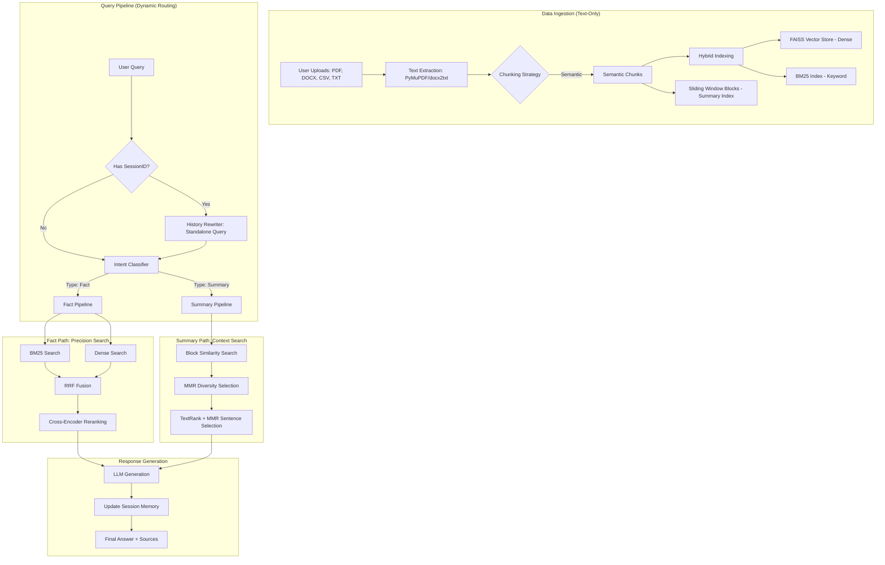

# InsightAI 🤖 — Advanced RAG Chatbot

InsightAI is a professional-grade full-stack chatbot that enables deep document analysis. It combines a high-performance **FastAPI** backend with a modern **React/TypeScript** frontend, featuring a hybrid RAG pipeline designed for both factual retrieval and multi-document summarization.

---

## 🛠 Tech Stack

### **Frontend**
- **React 18 & TypeScript**: For a type-safe, component-based UI.
- **Vite**: Ultra-fast build tool and dev server.
- **Tailwind CSS**: For a sleek, responsive dark-mode interface.
- **Markdown & KaTeX**: Properly renders AI responses with lists, code blocks, and math.

### **Backend**
- **Python 3.9+ & FastAPI**: Asynchronous REST API for high performance.
- **PyMuPDF (fitz)**: High-speed PDF text and structure extraction.
- **docx2txt & CSV**: Support for Office and data documents.
- **Docker & Docker Compose**: For seamless, containerized deployment.

### **AI & RAG Engine**
- **Embeddings**: `BAAI/bge-small-en-v1.5` (via HuggingFace) for high-quality semantic vectors.
- **Vector Store**: **FAISS** (Facebook AI Similarity Search) for dense retrieval.
- **Keyword Search**: **BM25 (Rank-BM25)** for precise term matching.
- **Reranker**: **Cross-Encoder** (`ms-marco-MiniLM`) for scoring candidates after retrieval.
- **LLM Support**: 
  - **Local-first**: Integration with **LM Studio** (OpenAI-compatible endpoint).
  - **Fallback**: **Google Gemini API** support.

---

## 🏗 Architecture & Workflow

InsightAI follows a sophisticated retrieval-augmented generation (RAG) pattern, optimized for both precision and broad context understanding.



---

## 🧠 Advanced Engineering Decisions

To stand out, this project implements several advanced information retrieval techniques:

1.  **Hybrid Search (BM25 + Dense)**: Combines keyword-based matching with semantic understanding to solve the "vocabulary mismatch" problem.
2.  **RRF Fusion & Reranking**: Uses Reciprocal Rank Fusion to merge search results and a secondary Reranker to ensure the Top-K chunks are the most relevant.
3.  **Dynamic Query Classification**: The system detects if a user wants a **Fact** (specific answer) or a **Summary** (overview), routing the request through specialized pipelines.
4.  **MMR (Maximal Marginal Relevance)**: For summary queries, the system uses MMR to select chunks that are relevant *but diverse*, avoiding redundant info in the final context.
5.  **TextRank-based Summarization**: Uses a sentence-level Graph algorithm (PageRank style) to extract core sentences before generating the final answer.
6.  **Conversation Memory**: Implements **Query Rewriting** using session history, allowing the AI to understand pronouns (e.g., "What about its first chapter?") by looking at previous exchanges.

---

## 🚀 Getting Started

### 1. Prerequisites
- Python 3.9+ & Node.js 18+
- (Optional) [LM Studio](https://lmstudio.ai/) running a local model.

### 2. Setup Environment
#### **Backend** (`backend/.env`):
```env
# Local LLM (via LM Studio)
LMSTUDIO_BASE_URL=http://localhost:1234
LMSTUDIO_MODEL=your-local-model-name

# Fallback (optional)
# GOOGLE_API_KEY=your-api-key
```

#### **Frontend** (`frontend/.env`):
```env
# Backend API Location
VITE_API_BASE_URL=http://localhost:8000

# Optional: set longer timeout for RAG queries (ms)
# VITE_API_TIMEOUT_MS=300000
```

### 3. Run with Docker (Recommended)
```bash
docker compose up --build
```
Access at: Frontend [http://localhost:5173](http://localhost:5173) | Backend [http://localhost:8000](http://localhost:8000)

---

## 💾 Manual Installation (Alternative)

If you prefer running without Docker:

### **Backend**
```bash
cd backend
python -m venv venv
source venv/bin/activate  # Windows: venv\\Scripts\\activate
pip install -r requirements.txt
uvicorn main:app --reload --port 8000
```

### **Frontend**
```bash
cd frontend
npm install
npm run dev
```

---

## 📈 Future Improvements
- **Structural Chunking**: Moving from flat semantic chunks to structure-aware hierarchy (Sections, Tables, Hierarchical indexing).
- **Pre-retrieval Optimization**: Implementing Query Expansion (Hypothetical Document Embeddings - HyDE) and Query Decomposition.
- **Knowledge Graph Integration (GraphRAG)**: Building entity-relationship graphs to enable complex multi-hop reasoning.
- **Streaming SSR**: Implement Server-Sent Events (SSE) for token-by-token streaming.
---
