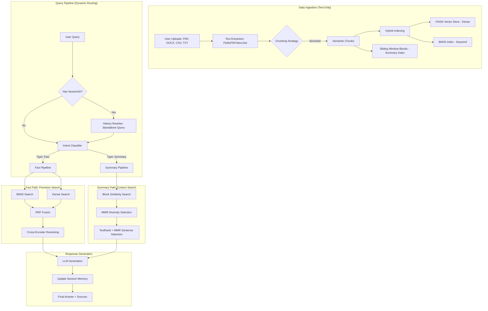

# InsightAI 🤖 — Advanced RAG Chatbot

InsightAI is a professional-grade full-stack chatbot that enables deep document analysis. It combines a high-performance **FastAPI** backend with a modern **React/TypeScript** frontend, featuring a hybrid RAG pipeline designed for both factual retrieval and multi-document summarization.

---

## 🛠 Tech Stack

### **Frontend**
- **React 18 & TypeScript**: For a type-safe, component-based UI.
- **Vite**: Ultra-fast build tool and dev server.
- **Tailwind CSS**: For a sleek, responsive dark-mode interface.
- **Markdown & KaTeX**: Properly renders AI responses with lists, code blocks, and math.

### **Backend**
- **Python 3.9+ & FastAPI**: Asynchronous REST API for high performance.
- **PyMuPDF (fitz)**: High-speed PDF text and structure extraction.
- **docx2txt & CSV**: Support for Office and data documents.
- **Docker & Docker Compose**: For seamless, containerized deployment.

### **AI & RAG Engine**
- **Embeddings**: `BAAI/bge-small-en-v1.5` (via HuggingFace) for high-quality semantic vectors.
- **Vector Store**: **FAISS** (Facebook AI Similarity Search) for dense retrieval.
- **Keyword Search**: **BM25 (Rank-BM25)** for precise term matching.
- **Reranker**: **Cross-Encoder** (`ms-marco-MiniLM`) for scoring candidates after retrieval.
- **LLM Support**: 
  - **Local-first**: Integration with **LM Studio** (OpenAI-compatible endpoint).
  - **Fallback**: **Google Gemini API** support.

---

## 🏗 Architecture & Workflow

InsightAI follows a sophisticated retrieval-augmented generation (RAG) pattern, optimized for both precision and broad context understanding.



---

## 🧠 Architecture Decisions & Trade-offs

This project is built with a focus on **privacy, performance, and transparency**. Every technical choice was made by weighing the pros and cons of modern AI engineering patterns.

### 1. **Backend Service: Why FastAPI?**
*   **Decision**: Use **FastAPI** over Flask or Django.
*   **Rational**: RAG applications are I/O bound (waiting for embeddings, vector search, and LLM responses). FastAPI’s native **asynchronous (async/await)** support allows handling concurrent requests efficiently without blocking the event loop.

### 2. **Context Retrieval: Why Hybrid Search (BM25 + Dense)?**
*   **Decision**: Implementing a **Two-Tier Retrieval** system.
*   **Trade-off**: 
    *   **Dense (Vector) only**: Great at capturing meaning but often fails at finding specific terms (e.g., product IDs, rare names).
    *   **Keyword (BM25) only**: Precise for exact matches but misses synonyms.
*   **Result**: By using **RRF (Reciprocal Rank Fusion)** to merge both, InsightAI achieves high recall and precision, solving the "vocabulary mismatch" problem common in basic RAG.

### 3. **The Local LLM vs. Cloud API Trade-off**
*   **Decision**: Supporting **LM Studio (Local)** as primary and **Gemini (Cloud)** as fallback.
*   **Trade-off Analysis**:
    *   **Local Models (Llama 3 / Qwen)**: 
        *   *Pros*: Zero cost, data never leaves the machine (GDPR/Privacy friendly), no rate limits.
        *   *Cons*: Slower without high-end GPUs, reasoning quality is lower than GPT-4o.
    *   **Cloud Models (Gemini/GPT)**:
        *   *Pros*: State-of-the-art reasoning, zero infrastructure setup.
        *   *Cons*: Privacy risks, latency, cost per token.
*   **Result**: InsightAI gives users the choice, making it a professional-grade "Privacy-First" tool.

### 4. **Chunking Strategy: Recursive vs. Semantic**
*   **Decision**: Implementing **Semantic Chunking** as the base layer.
*   **Trade-off**: 
    *   **Recursive/Fixed-size**: Fast and predictable but often breaks a sentence in the middle, losing context.
    *   **Semantic**: Breaks text based on "meaning shifts" (using embeddings). 
*   **Result**: Higher indexing time, but significantly better retrieval accuracy as chunks are more coherent.

### 5. **Summarization Pipeline: Why the Block-based pattern?**
*   **Decision**: Recursive Retrieval (Small-to-Big pattern) using **Hierarchical Blocks**.
*   **Trade-off**: Retrieving large blocks directly captures context but hits token limits. Splitting them into chunks and filtering them back via **MMR (Maximal Marginal Relevance)** ensures the LLM receives only the most diverse and high-impact information, avoiding the "lost in the middle" phenomenon.

---

## 🚀 Getting Started

### 1. Prerequisites
- Python 3.9+ & Node.js 18+
- (Optional) [LM Studio](https://lmstudio.ai/) running a local model.

### 2. Setup Environment
#### **Backend** (`backend/.env`):
```env
# Local LLM (via LM Studio)
LMSTUDIO_BASE_URL=http://127.0.0.1:1234
LMSTUDIO_MODEL=your-local-model-name

# Fallback (optional)
GOOGLE_API_KEY=your-api-key  # Required if not using LM Studio
```

#### **Frontend** (`frontend/.env`):
```env
# Backend API Location
VITE_API_BASE_URL=http://localhost:8000


```

### 3. Run with Docker (Recommended)
```bash
docker compose up --build
```
Access at: Frontend [http://localhost:5173](http://localhost:5173) | Backend [http://localhost:8000](http://localhost:8000)

---

## 💾 Manual Installation (Alternative)

If you prefer running without Docker:

### **Backend**
```bash
cd backend
python -m venv venv
source venv/bin/activate  # Windows: venv\\Scripts\\activate
pip install -r requirements.txt
uvicorn main:app --reload --port 8000
```

### **Frontend**
```bash
cd frontend
npm install
npm run dev
```

---

## 📈 Future Improvements
- **Structural Chunking**: Moving from flat semantic chunks to structure-aware hierarchy (Sections, Tables, Hierarchical indexing).
- **Pre-retrieval Optimization**: Implementing Query Expansion (Hypothetical Document Embeddings - HyDE) and Query Decomposition.
- **Knowledge Graph Integration (GraphRAG)**: Building entity-relationship graphs to enable complex multi-hop reasoning.
- **Streaming SSR**: Implement Server-Sent Events (SSE) for token-by-token streaming.
---
